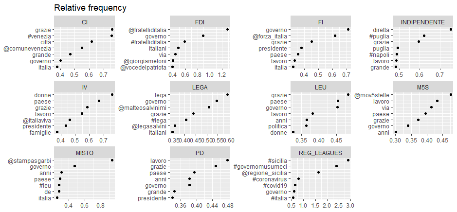

```{r setup_1, include=FALSE}
knitr::opts_chunk$set(echo = TRUE)
source(here::here("src","00_setup.R"))
```

# Data cleaning

## Import the dataset and check variables

```{r}
# import the data
tw <-  read_csv("data/large_files/politicians_final_corrected.csv",
                show_col_types = FALSE )
#save(tw,file="data/tw.Rda")
kable(colnames(tw), col.names = "variables")
```

## Adjust date.time format

```{r, results = "hide"}
# RUN IN THIS ORDER !!
Sys.setlocale("LC_TIME", "C")
tw$date <- as.Date(strptime(tw$creato_il,"%a %b %d %H:%M:%S %z %Y",
                            tz = "CET"))
tw$date <- na.replace(tw$date, as.Date(tw$creato_il))
```

### Check the conversion

```{r}
check_dates <- tw %>% select(creato_il,date)
kable(head(check_dates), col.names = c("Old date", "New date"))
kable(tail(check_dates), col.names = c("Old date", "New date"))
```

## Create the week variable

```{r}
tw <- tw %>% mutate(week = cut.Date(date, breaks = "1 week", labels = FALSE))
```

### Check the variable

Inspect the first and the last dates and check if the number of weeks is correct

```{r}
max(tw$date)
min(tw$date)
difftime(max(tw$date), min(tw$date), units = "weeks")
```

## Create the month variable

```{r}
tw <- tw %>% mutate(month = cut.Date(date, breaks = "1 month", labels = FALSE))
```

### Check the number of month

```{r}
max(tw$month)
length(seq(from = min(tw$date), to = max(tw$date), by = 'month'))
```

## Create the trimester variable

```{r}
tw <- tw %>% mutate(quarter = cut.Date(date, breaks = "1 quarter", labels = FALSE))
```

### Check the number of trimesters

```{r}
max(tw$quarter)
length(seq.Date(from = min(tw$date), to = max(tw$date), by = 'quarter'))
```

## Create the year variables

```{r}
tw <- tw %>% mutate(year = cut.Date(date, breaks = "year", labels = FALSE))
```

### Check the number of years

```{r}
max(tw$year)
length(seq.Date(from = min(tw$date), to = max(tw$date), by = 'year'))
```

## Count the number of missing values

```{r}
sum(is.na(tw))
```

### Inspect where are the missings

```{r}

missings <- c(
sum(is.na(tw$tw_screen_name)),
sum(is.na(tw$nome)),
sum(is.na(tw$tweet_testo)),
sum(is.na(tw$creato_il)),
sum(is.na(tw$creato_il_code)),
sum(is.na(tw$url)),
sum(is.na(tw$party_id)),
sum(is.na(tw$genere)),
sum(is.na(tw$chamber)),
sum(is.na(tw$status)),
sum(is.na(tw$date)),
sum(is.na(tw$week)),
sum(is.na(tw$month)),
sum(is.na(tw$quarter)),
sum(is.na(tw$year)))

missing_df <- data.frame(colnames(tw), missings)
kable(missing_df)

```

### Remove rows with missing tweets

```{r}
sum(is.na(tw$tweet_testo))
tw <- tw %>% drop_na(tweet_testo)
```

## Check that the variables make sense

```{r}
unique(tw$party_id)
unique(tw$genere)
unique(tw$chamber)
unique(tw$status)
```

### Adjust the variable genere

```{r}
# Remove space from genere variable [RUN ONLY ONCE!]
a <- unique(tw$genere)
a[3]
which(tw$genere == a[3])
tw$genere <- gsub(a[3],"male",tw$genere)
```

### Verify the substitution

```{r}
which(tw$genere == a[3])
unique(tw$genere)
```

**Now all the variables are ready for next steps**

## Create a new dataset selecting only necessary informations

```{r}
# Select variables for the analysis
dataset <- tw %>% select(nome, tweet_testo, genere, party_id,
                         chamber,status, date, week, month, quarter, year )
colnames(dataset)
```

```{r, include=FALSE, eval=FALSE}
#save(dataset,file="data/dataset.Rda")
```

## Create the corpus

```{r}
corpus <- corpus(dataset, text = "tweet_testo")
ndoc(corpus)
```

```{r, include=FALSE, eval=FALSE}
#save(corpus,file="data/corpus.Rda")
```

## Create the DFM

```{r}
# Split the corpus into single tokens (remain positional)
doc.tokens <- tokens(corpus,
                                 remove_punct = TRUE,
                                 remove_numbers = TRUE,
                                 remove_symbols = TRUE,
                                 remove_url = TRUE)

# Import my stopwords
my_word <- as.list(read_csv("data/it_stopwords_new_list.csv",
                            show_col_types = FALSE))

# Attach unrecognized symbols
my_list <- c("🇮🇹","c'è","+","🔴", my_word$stopwords,
             stopwords('italian'), stopwords("english"))

# Save my_list
#save(my_list,file="data/my_list.Rda")

doc.tokens <- tokens_select(doc.tokens, my_list, selection='remove')

DFM <- dfm(doc.tokens, tolower = TRUE)
```

## Remove the emoji

```{r, results="hide"}
# Create a copy of the dfm
test <- DFM
# Remove from the copy all the non ASCII carachters
test@Dimnames$features <- gsub("[^\x01-\x7F]", "", test@Dimnames$features)

# Check the difference from the list of features before and after apply gsub
a <- unique(test@Dimnames$features)
b <- unique(DFM@Dimnames$features)
setdiff(b,a) #I have selected also words that must not be removed

# Create an object with the features after remove non ASCII characters
c <- test@Dimnames$features
# Create an object with the original features
d <- DFM@Dimnames$features

# Create the list of the removed features
diff <- setdiff(d,c)
emoji <- diff[diff %>% nchar() < 4] 
emoji <- list(emoji)
# Now i can remove this list from the dfm
DFM <- dfm_remove(DFM, emoji)

#save(DFM,file="data/dfm.Rda")
```


**Now the data are ready for the next analysis**

\newpage

# Preliminar analysis

## Who is inside this dataset?

```{r}
# Number of parliamentarians
n_parl <- length(unique(dataset$nome))
n_parl

# How many parliamentarians for each party_id?
n_parl_party <- dataset %>% select(party_id, nome) %>%
  group_by(party_id) %>% unique() %>% count() %>%
  arrange(desc(n))
kable(n_parl_party)

# Gender composition
n_gender <- dataset %>% select(genere, nome) %>%
  group_by(genere) %>% unique() %>% count()
kable(n_gender)

# Wich is the period of analysis?
max(tw$date)
min(tw$date)
```

## Topfeatures frequency

```{r, warning=FALSE}
# Textplotwordcloud
set.seed(123)
textplot_wordcloud(DFM, min_count = 20,max_words = 200,
     color = c('red', 'pink', 'green', 'purple', 'blue'))
```

```{r}
# Plot frequency of the topfeatures in the DFM
features_dfm <- textstat_frequency(DFM, n = 50)
# Sort by reverse frequency order
features_dfm$feature <- with(features_dfm, reorder(feature, -frequency))
ggplot(features_dfm, aes(x = feature, y = frequency)) +
  geom_point() +
  theme(axis.text.x = element_text(angle = 90, hjust = 1))


```

### Relative frequency of the topfeatures by Party ID

```{r}
# group and weight the DFM
dfm_party_weight <- dfm_group(DFM, groups = party_id) %>%
  dfm_weight(scheme = "prop")
```

```{r, eval=FALSE}
# Plot relative frequency by party_id
freq_weight <- textstat_frequency(dfm_party_weight, n = 7, groups = party_id)


ggplot(data = freq_weight, aes(x = nrow(freq_weight):1, y = frequency)) +
     geom_point() +
     facet_wrap(~ group, scales = "free") +
     coord_flip() +
     scale_x_continuous(breaks = nrow(freq_weight):1,
                        labels = freq_weight$feature) +
  ggtitle("Relative frequency") +
  labs(x = NULL, y = NULL)
```



## Most common hashtag

```{r}
tag_dfm <- dfm_select(DFM, pattern = "#*")
toptag <- names(topfeatures(tag_dfm, 20))
toptag
```

```{r, echo=FALSE}
tag_dfm %>% 
  textstat_frequency(n = 20) %>% 
  ggplot(aes(x = reorder(feature, frequency), y = frequency)) +
  geom_point() +
  coord_flip() +
  labs(x = NULL, y = "Absolute frequency") +
  theme_minimal()
```

### Most common hashtag by Gender

```{r}
# group and weight the DFM
dfm_gender_weight <- dfm_group(tag_dfm, groups = genere) %>%
  dfm_weight(scheme = "prop")

tstat_freq <- textstat_frequency(dfm_gender_weight, n = 20,
                                 groups = dfm_gender_weight$genere)
```

```{r, echo=FALSE}
# Plot relative frequency by Gender
ggplot(data = tstat_freq, aes(x = nrow(tstat_freq):1, y = frequency)) +
     geom_point() +
     facet_wrap(~ group, scales = "free") +
     coord_flip() +
     scale_x_continuous(breaks = nrow(tstat_freq):1,
                        labels = tstat_freq$feature) +
     labs(x = NULL, y = "Relative frequency")
```

### Co-occurrence Plot of hashtags

```{r}
tag_dfm_NOT_W <- dfm_select(DFM, pattern = "#*")
toptag_NOT <- names(topfeatures(tag_dfm_NOT_W, 20))

tag_fcm_NOT <- fcm(tag_dfm_NOT_W)
set.seed(666)
topgat_fcm_NOT <- fcm_select(tag_fcm_NOT, pattern = toptag_NOT)
textplot_network(topgat_fcm_NOT, min_freq = 0.1,
                 edge_alpha = 0.8, edge_size = 5)
```

## Most frequently mentioned usernames

```{r}
user_dfm <- dfm_select(DFM, pattern = "@*")
topuser <- names(topfeatures(user_dfm, 20, scheme = "docfreq"))
kable(topuser, col.names = "Most mentioned username")
```

### Most frequently mentioned usernames by gender

```{r}
# group and weight the DFM
user_dfm_gender_weight <- dfm_group(user_dfm, groups = genere) %>%
  dfm_weight(scheme = "prop")

user_tstat_freq <- textstat_frequency(
  user_dfm_gender_weight,
  n = 20,
  groups = user_dfm_gender_weight$genere)
```

```{r, echo=FALSE}
# Plot relative frequency by Gender
ggplot(data = user_tstat_freq, aes(x = nrow(user_tstat_freq):1, y = frequency)) +
     geom_point() +
     facet_wrap(~ group, scales = "free") +
     coord_flip() +
     scale_x_continuous(breaks = nrow(user_tstat_freq):1,
                        labels = user_tstat_freq$feature) +
     labs(x = NULL, y = "Relative frequency")
```

### Co-occurrence plot of usernames

```{r, echo=FALSE}
user_dfm_NOT_W <- dfm_select(DFM, pattern = "@*")
topuser_NOT <- names(topfeatures(user_dfm_NOT_W, 20, scheme = "docfreq"))

user_fcm_NOT <- fcm(user_dfm_NOT_W)
set.seed(6)
topuser_fcm_NOT <- fcm_select(user_fcm_NOT, pattern = topuser_NOT)
textplot_network(topuser_fcm_NOT, min_freq = 0.1, edge_alpha = 0.8, edge_size = 5)
```

## How many times a politician cite his/her party

```{r, include=FALSE}
load("data/party_citations.Rda")
```

```{r, eval =FALSE}
party_citations <- data.frame(first = vector(), second = vector() )
system.time(
for (i in unique(tw$party_id))
{
  a <- paste("#", i ,sep = "")
  b <- tw %>% filter(grepl(a,tweet_testo)&party_id== i) %>% count()
  c <- tw %>% filter(party_id == i) %>% count()
  d <- (b/c) * 100
  party_citations <- rbind(party_citations, cbind(i,b,c,d))

}
)

#save(party_citations, file = "data/party_citations.Rda")
```

```{r}
colnames(party_citations) <- c("party","n_citations", "Number of tweets", "perc")

kable(party_citations %>% arrange(desc(perc)),
      col.names = c("Party","Number of citations",
                    "number of tweets", "% of citations"))
```

In the above script i search the \# for the parliamentary group, but is very unlikely, for example, that someone use the #IV for talking about the "Italia Viva" party, so i decided to enrich the dataframe creating a new variable with the name of the official twitter page for every party, and repeat the search using it.

I created the variable party_Page for only those parliamentary group that has a direct connection with a party (i excluded Reg_leagues, misto and indipendente)

### Create the variable with the name of the official Twitter account

```{r}
tw <- tw %>% mutate(party_page = if_else(party_id == "PD", "@pdnetwork",
if_else( party_id == "FDI", "@FratellidItalia",
    if_else(party_id == "M5S", "@Mov5Stelle",
      if_else(party_id == "FI", "@forza_italia",
        if_else(party_id == "LEGA", "@LegaSalvini",                                          if_else(party_id == "IV", "@ItaliaViva",
            if_else(party_id == "CI", "@coraggio_italia",
              if_else(party_id == "LEU", "@liberi_uguali",
                                                      "NA")))))))))

```

### Count for each party how many times a politician cite their respective party

```{r, include=FALSE}
load("data/party_citations_page.Rda")
```

```{r,eval=FALSE}
party_citations_page <- data.frame(first = vector(), second = vector(),
                                  third = vector(), fourth = vector())
system.time(
  for (i in unique(tw$party_page))
  {
    b <- tw %>% filter(grepl(i,tweet_testo)&party_page== i) %>% count()
    c <- tw %>% filter(party_page == i) %>% count()
    d <- (b/c) * 100
    party_citations_page <- rbind(party_citations_page, cbind(i,b,c,d))
    
  }
)
# save(party_citations_page, file = "data/party_citations_page.Rda")
```

```{r}
colnames(party_citations_page) <- c("party","n_citations",
                                    "Number of tweets", "perc")

kable(party_citations_page %>% filter(party != "NA") %>%
        arrange(desc(perc)),
      col.names = c("Party","Number of citations",
                    "number of tweets", "% of citations"))
```

## How many times the party leader is cited by his/her party

### Create the variable with the official leader's account for every party

```{r}
tw <- tw %>% mutate(party_leader =
if_else(party_id == "PD" & date < "2021-03-14", "@nzingaretti",
if_else(party_id == "PD" & date > "2021-03-14", "@EnricoLetta",
if_else( party_id == "FDI", "@GiorgiaMeloni",
if_else(party_id == "M5S" &date < "2020-01-22" , "@luigidimaio",
if_else(party_id == "M5S" &date > "2020-01-22" &date < "2021-08-06", "@vitocrimi",
if_else(party_id == "M5S" & date > "2021-08-061", "@GiuseppeConteIT",
if_else(party_id == "FI", "@berlusconi",
if_else(party_id == "LEGA", "@matteosalvinimi",
if_else(party_id == "IV", "@matteorenzi",
if_else(party_id == "CI", "@LuigiBrugnaro",
if_else(party_id == "LEU", "@robersperanza",
"NA"))))))))))))
```

### Count for each party how many times a politician cite his/ her party leader

```{r, eval = FALSE}
leader_citations <- data.frame(first = vector(), second = vector(),
                                  third = vector(), fourth = vector())
system.time(
  for (i in unique(tw$party_leader))
  {
    b <- tw %>% filter(grepl(i,tweet_testo)&party_leader== i) %>% count()
    c <- tw %>% filter(party_leader == i) %>% count()
    d <- (b/c) * 100
    leader_citations <- rbind(leader_citations, cbind(i,b,c,d))
    
  }
)
 #save(leader_citations, file = "data/leader_citations.Rda")
```

```{r, include = FALSE}
load("data/leader_citations.Rda")
```

```{r}
colnames(leader_citations) <- c("leader","n_citations",
                                    "Number of tweets", "perc")

kable(leader_citations %>% filter(leader != "NA") %>%
        arrange(desc(perc)),
      col.names = c("Leader","Number of citations",
                    "Number of tweets", "% of citations"))
```

## How many times a politician cite itself in the tweet

```{r, include=FALSE}
load("data/self_citations.Rda")
```

```{r, eval=FALSE}
self_citations <- data.frame(first = vector(), second = vector() )
system.time(
for (i in unique(tw$tw_screen_name))
{
  a <- paste("@", i ,sep = "")
  b <- tw %>% filter(grepl(a,tweet_testo) & tw_screen_name== i) %>% count()
  c <- tw %>% filter(tw_screen_name == i) %>% count()
  d <- (b/c) * 100
  self_citations <- rbind(self_citations, cbind(i,b,c,d))
}
)
#save(self_citations, file = "data/self_citations.Rda")
```

```{r}
colnames(self_citations) <- c("Politician","n_citations",
                              "Number of tweets", "perc")

kable(self_citations %>% filter(n_citations > 2) %>%
        arrange(desc(perc)),
      col.names = c("Politician","Number of citations",
                    "Number of tweets", "% of citations"))
```
