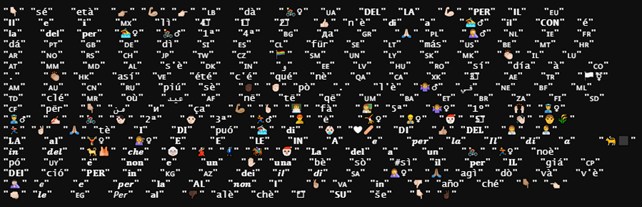

```{r setup, include=FALSE}
knitr::opts_chunk$set(echo = TRUE)
source(here::here("src","00_setup.R"))
```

# Part I: Data cleaning

## 1) First import the dataset and check variables

```{r}
# import the data
tw <-  read_csv("data/large_files/politicians_final_corrected.csv", show_col_types = FALSE )

kable(colnames(tw), col.names = "variables")
```

## 2) Adjust date.time format

```{r, results = "hide"}
# RUN IN THIS ORDER !!
Sys.setlocale("LC_TIME", "C")
tw$date <- as.Date(strptime(tw$creato_il,"%a %b %d %H:%M:%S %z %Y", tz = "CET"))
tw$date <- na.replace(tw$date, as.Date(tw$creato_il))
```

### Check the conversion

```{r}
check_dates <- tw %>% select(creato_il,date)
kable(head(check_dates), col.names = c("Old date", "New date"))
kable(tail(check_dates), col.names = c("Old date", "New date"))
```

## 3) Create the week variable

```{r}
tw <- tw %>% mutate(week = cut.Date(date, breaks = "1 week", labels = FALSE))
```

#### Inspect the first and the last dates and check if the number of weeks is correct

```{r}
max(tw$date)
min(tw$date)
difftime(max(tw$date), min(tw$date), units = "weeks")
```

### Create the month variable

```{r}
tw <- tw %>% mutate(month = cut.Date(date, breaks = "1 month", labels = FALSE))
```

#### Check the number of month

```{r}
max(tw$month)
length(seq(from = min(tw$date), to = max(tw$date), by = 'month'))
```

### Count the number of missing values

```{r}
sum(is.na(tw))
```

### Inspect where are those missings

```{r}

missings <- c(
sum(is.na(tw$tw_screen_name)),
sum(is.na(tw$nome)),
sum(is.na(tw$tweet_testo)),
sum(is.na(tw$creato_il)),
sum(is.na(tw$creato_il_code)),
sum(is.na(tw$url)),
sum(is.na(tw$party_id)),
sum(is.na(tw$genere)),
sum(is.na(tw$chamber)),
sum(is.na(tw$status)),
sum(is.na(tw$date)),
sum(is.na(tw$week)),
sum(is.na(tw$month)) )

missing_df <- data.frame(colnames(tw), missings)
kable(missing_df)

```

### From that analysis i obtain 148178 url missing, this is because the url is collected only when the tweets has an external link to other sources, for our analysis we can ignore those missings, with this check also results 6494 tweets missing those are the cases when someone post only images or video without text, so the extraction is correct.

## 4) Remove the rows with missing tweets

```{r}
sum(is.na(tw$tweet_testo))
tw <- tw %>% drop_na(tweet_testo)
```

## 5) Check that the variables make sense

```{r}
unique(tw$party_id)
unique(tw$genere)
unique(tw$chamber)
unique(tw$status)
```

### The variable genere needs to be corrected

```{r}
# Remove space from genere variable [RUN ONLY ONCE!]
a <- unique(tw$genere)
a[3]
which(tw$genere == a[3])
tw$genere <- gsub(a[3],"male",tw$genere)
```

### Check the substitution

```{r}
which(tw$genere == a[3])
unique(tw$genere)
```

### Now all the variables are ready for next steps

## 6) Create a new dataset with only necessary informations

```{r}
# Select variables for the analysis
dataset <- tw %>% select(nome, tweet_testo, genere, party_id,chamber,status, date, week, month )
colnames(dataset)
```

```{r, include=FALSE, eval=FALSE}
#save(dataset,file="data/dataset.Rda")
```

## 7) Create the corpus

```{r}
corpus <- corpus(dataset, text = "tweet_testo")
ndoc(corpus)
```

```{r, include=FALSE, eval=FALSE}
#save(corpus,file="data/corpus.Rda")
```

## 8) Create the DFM

```{r}
# Split the corpus into single tokens (remain positional)
doc.tokens <- tokens(corpus,
                                 remove_punct = TRUE,
                                 remove_numbers = TRUE,
                                 remove_symbols = TRUE,
                                 remove_url = TRUE)

# Import my stopwords
my_word <- as.list(read_csv("data/it_stopwords_new_list.csv",
                            show_col_types = FALSE))

# Attach unrecognized symbols
my_list <- c("🇮🇹","c'è","+","🔴", my_word$stopwords, stopwords('italian'), stopwords("english"))

# Save my_list
#save(my_list,file="data/my_list.Rda")

doc.tokens <- tokens_select(doc.tokens, my_list, selection='remove')

DFM <- dfm(doc.tokens, tolower = TRUE)
```

## 9) Trim the data

### Only words that occur in the top 20% of the distribution and in less than 30% of documents. Very frequent but document specific words.

```{r}
DFM_trimmed <- dfm_trim(DFM, min_termfreq = 0.80, termfreq_type = "quantile",
                        max_docfreq = 0.3, docfreq_type = "prop")

# Check the topfeatures
topfeatures(DFM_trimmed,15)
```

## 10) Remove the emoji

```{r, results="hide"}
# Create a copy of the dfm
test <- DFM_trimmed
# Remove from the copy all the non ASCII carachters
test@Dimnames$features <- gsub("[^\x01-\x7F]", "", test@Dimnames$features)

# Check the difference from the list of features before and after apply gsub
a <- unique(test@Dimnames$features)
b <- unique(DFM_trimmed@Dimnames$features)
setdiff(b,a) #I have selected also words that cannot be removed

# Create an object with the features after remove non ASCII characters
c <- test@Dimnames$features
# Create an object with the original features
d <- DFM_trimmed@Dimnames$features

# Create the list of the removed features
diff <- setdiff(d,c)
emoji <- diff[diff %>% nchar() < 4] 
emoji <- list(emoji)
emoji
# Now i can remove this list from the dfm
DFM_trimmed <- dfm_remove(DFM_trimmed, emoji)

#save(DFM_trimmed,file="data/dfm_trimmed.Rda")
```



## 11) Weight the feature frequencies in the dfm

```{r}
# Weight the frequency
dfm_weight <- DFM_trimmed %>%
  dfm_weight(scheme = "prop")
```

### Now the data are ready for the next analysis

```{r, include=FALSE, eval=FALSE}
#save(dfm_weight,file="data/dfm_weight.Rda")
```

# Part II: Preliminar analysis

## 1) Topfeatures frquency

```{r, warning=FALSE, echo=FALSE}
# Textplotwordcloud
set.seed(123)
textplot_wordcloud(dfm_weight,min_count = 20,max_words = 300,
     color = c('red', 'pink', 'green', 'purple', 'blue'))
```

```{r}
# Plot frequency of the topfeatures in the DFM
features_dfm <- textstat_frequency(dfm_weight, n = 50)

# Sort by reverse frequency order
features_dfm$feature <- with(features_dfm, reorder(feature, -frequency))

ggplot(features_dfm, aes(x = feature, y = frequency)) +
  geom_point() +
  theme(axis.text.x = element_text(angle = 90, hjust = 1))


```

### Relative frequency of the topfeatures by Party ID

```{r}
kable(unique(DFM_trimmed$party_id),col.names = "Party")
```

```{r}
# Plot relative frequency by party_id
freq_weight <- textstat_frequency(dfm_weight, n = 7, 
                                  groups = dfm_weight$party_id)

ggplot(data = freq_weight, aes(x = nrow(freq_weight):1, y = frequency)) +
     geom_point() +
     facet_wrap(~ group, scales = "free") +
     coord_flip() +
     scale_x_continuous(breaks = nrow(freq_weight):1,
                        labels = freq_weight$feature) +
     labs(x = NULL, y = "Relative frequency")
```

## 2) Most common hashtag

```{r}
tag_dfm <- dfm_select(dfm_weight, pattern = "#*")
toptag <- names(topfeatures(tag_dfm, 20))
toptag
```

```{r}
tag_dfm %>% 
  textstat_frequency(n = 20) %>% 
  ggplot(aes(x = reorder(feature, frequency), y = frequency)) +
  geom_point() +
  coord_flip() +
  labs(x = NULL, y = "Frequency") +
  theme_minimal()
```

### Most common hashtag by Gender

```{r}
tstat_freq <- textstat_frequency(tag_dfm, n = 20,
                                 groups = dfm_weight$genere)
```

```{r, echo=FALSE}
# Plot relative frequency by Gender
ggplot(data = tstat_freq, aes(x = nrow(tstat_freq):1, y = frequency)) +
     geom_point() +
     facet_wrap(~ group, scales = "free") +
     coord_flip() +
     scale_x_continuous(breaks = nrow(tstat_freq):1,
                        labels = tstat_freq$feature) +
     labs(x = NULL, y = "Relative frequency")
```

### Co-occurrence Plot of hashtags

```{r}
# NOT WEIGHTED
tag_dfm_NOT_W <- dfm_select(DFM, pattern = "#*")
toptag_NOT <- names(topfeatures(tag_dfm_NOT_W, 20))

tag_fcm_NOT <- fcm(tag_dfm_NOT_W)
set.seed(666)
topgat_fcm_NOT <- fcm_select(tag_fcm_NOT, pattern = toptag_NOT)
textplot_network(topgat_fcm_NOT, min_freq = 0.1, edge_alpha = 0.8, edge_size = 5)
```

```{r}
# WEIGHTED
tag_fcm <- fcm(tag_dfm)
set.seed(123)
topgat_fcm <- fcm_select(tag_fcm, pattern = toptag)
textplot_network(topgat_fcm)#, min_freq = 0.1, edge_alpha = 0.8, edge_size = 5)
```

```{r, eval=FALSE, include=FALSE}
# Check most frequent hashtag extracted with regular expressions
ht <- str_extract_all(dataset$tweet_testo, '#[A-Za-z0-9_]+')
ht <- unlist(ht)
head(sort(table(ht), decreasing = TRUE))
```

## 3) Most frequently mentioned usernames

```{r}
user_dfm <- dfm_select(dfm_weight, pattern = "@*")
topuser <- names(topfeatures(user_dfm, 20, scheme = "docfreq"))
kable(topuser, col.names = "Most mentioned username")
```

### Most frequently mentioned usernames by gender

```{r}
user_tstat_freq <- textstat_frequency(user_dfm, n = 20,
                                 groups = dfm_weight$genere)
```

```{r, echo=FALSE}
# Plot relative frequency by Gender
ggplot(data = user_tstat_freq, aes(x = nrow(user_tstat_freq):1, y = frequency)) +
     geom_point() +
     facet_wrap(~ group, scales = "free") +
     coord_flip() +
     scale_x_continuous(breaks = nrow(user_tstat_freq):1,
                        labels = user_tstat_freq$feature) +
     labs(x = NULL, y = "Relative frequency")
```

### Co-occurrence plot of usernames

```{r}
# WEIGHTED
user_fcm <- fcm(user_dfm)
set.seed(123)
user_fcm <- fcm_select(user_fcm, pattern = topuser)
textplot_network(user_fcm, min_freq = 0.1, edge_color = "orange", edge_alpha = 0.8, edge_size = 5)
```

```{r}
# NOT WEIGHTED
user_dfm_NOT_W <- dfm_select(DFM, pattern = "@*")
topuser_NOT <- names(topfeatures(user_dfm_NOT_W, 20, scheme = "docfreq"))

user_fcm_NOT <- fcm(user_dfm_NOT_W)
set.seed(6)
topuser_fcm_NOT <- fcm_select(user_fcm_NOT, pattern = topuser_NOT)
textplot_network(topuser_fcm_NOT, min_freq = 0.1, edge_alpha = 0.8, edge_size = 5)
```
